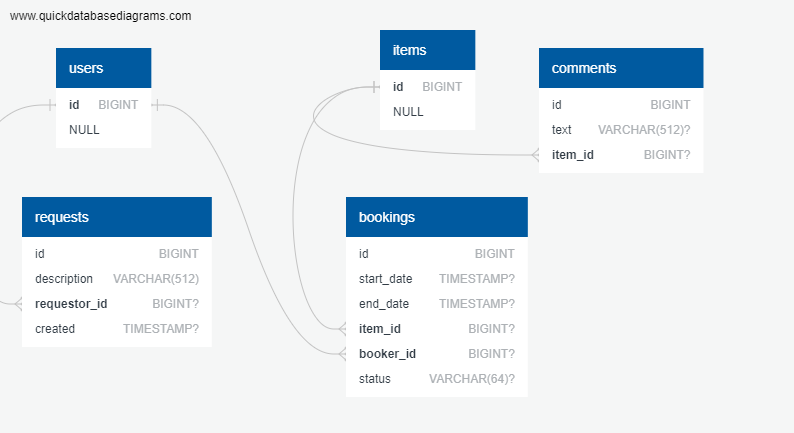

# java-shareit
Учебный проект Яндекс.Практикум

## Описание
        

Сервис для обмена вещами с другими пользователями. Он даёт пользователям возможность рассказывать, какими вещами они готовы поделиться, а так же находить нужную вещь и брать её в аренду на какое-то время.

## Архитектура

Сервис состоит из двух модулей:

+ ### gateway

  + Получение и валидация запросов пользователя.
  + Отправка полученного запрос на server.
  + Получение ответа от server.

+ ### server

  + Добавление/удаление пользователей, обновление данных, удаление.
  + Добавление/удаление/редактирование вещей.
  + Бронировать вещь на определённые даты и закрывает к ней доступ на время бронирования от других желающих.
  + Поиск вещей по названию или описанию, с возможностью фильтрации и постраничной выдачей.
  + Подтверждение или отклонение заявок на аренду владельцем.
  + Создание запроса на вещь, которая отсутствует в приложении.
  + Получение списка всех бронирований пользователя, с возможностью сортировки и фильтрации. 
  + Получение списка всех бронирований вещей, принадлежащих пользователю, с возможностью сортировки и фильтрации.
  + Получение списка всех вещей пользователя.
  + Добавление отзыва пользователем на вещь после того, как взял её в аренду.
  + Получение пользователем всех его запросов, с возможностью фильтрации и сортировки.

## База данных
